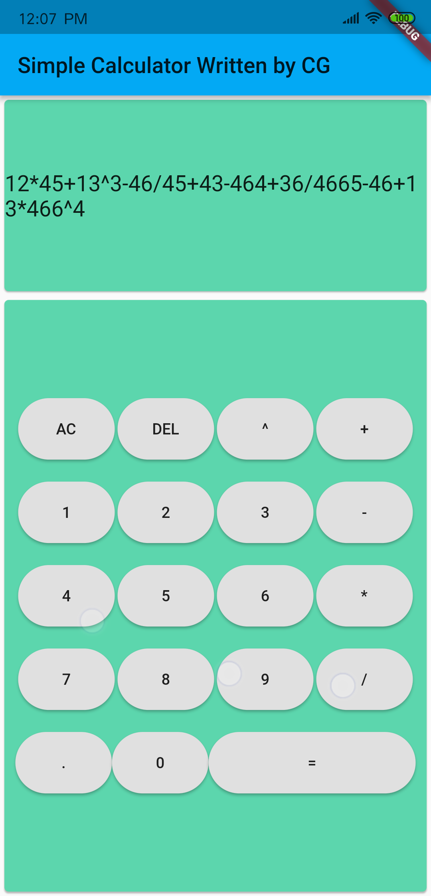
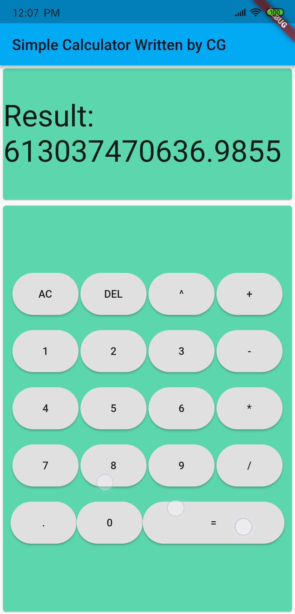

# Simple Calculator

A Simple Calculator Developed in Flutter [Flutter](https://flutter.io/)

- [Releases](https://github.com/CGQAQ/flutter_simple_calculator/releases)

## Getting Started
To build and run this project:

1. Get Flutter [here](https://flutter.dev) if you don't already have it
2. Clone this repository.
3. `cd` into the repo folder.
4. run `flutter run-android` or `flutter run-ios` to build the app.

(Please note that a Mac with XCode is required to build for iOS)

## Screenshot

          
  
